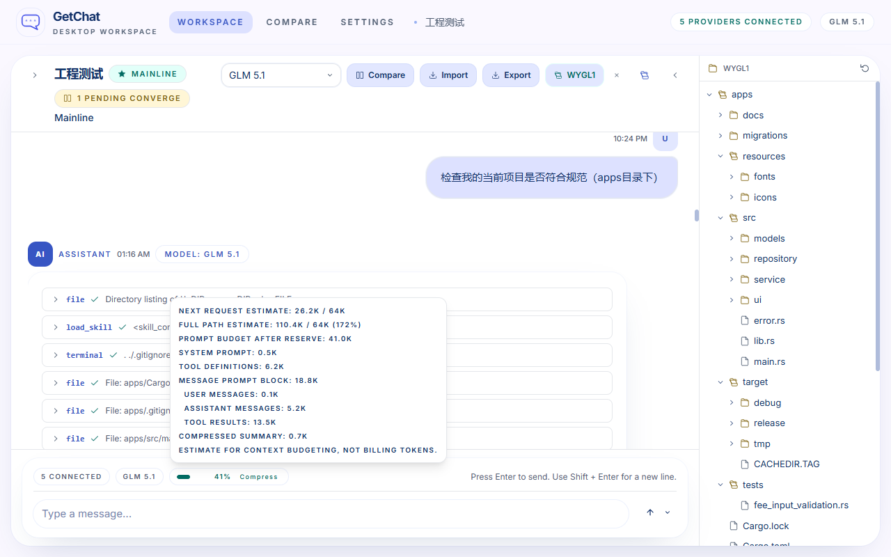
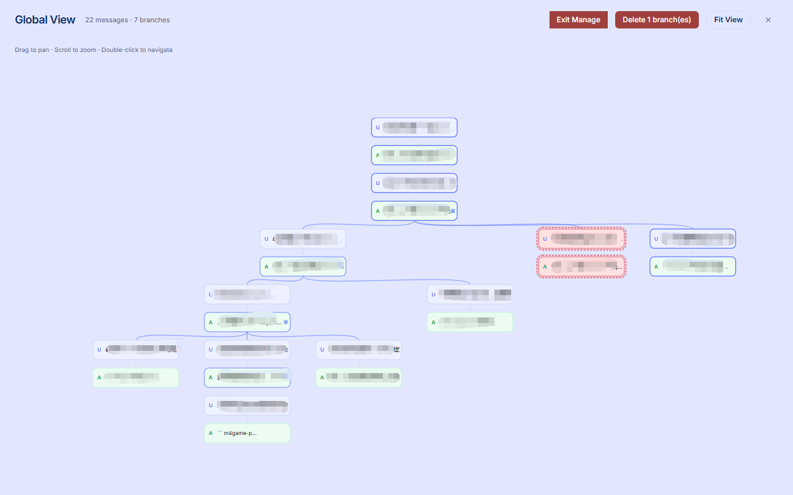
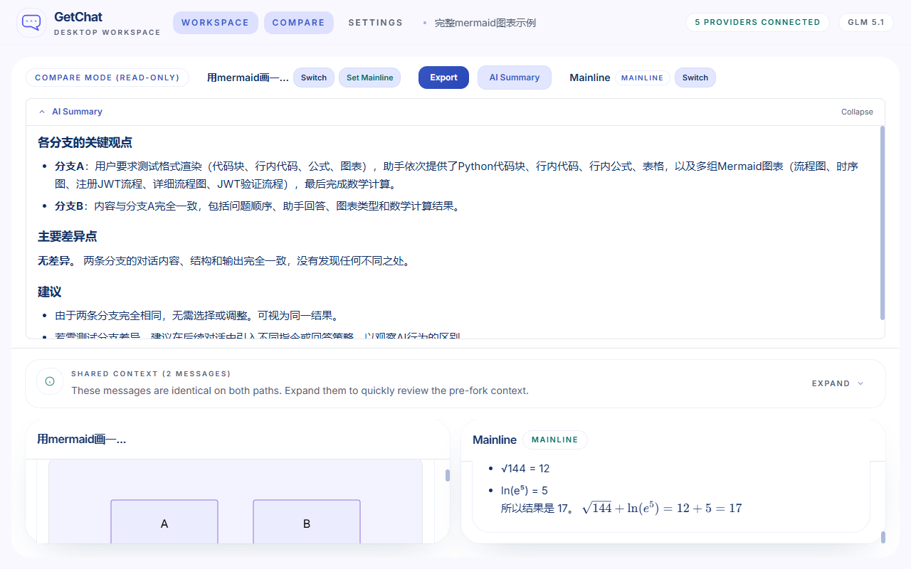
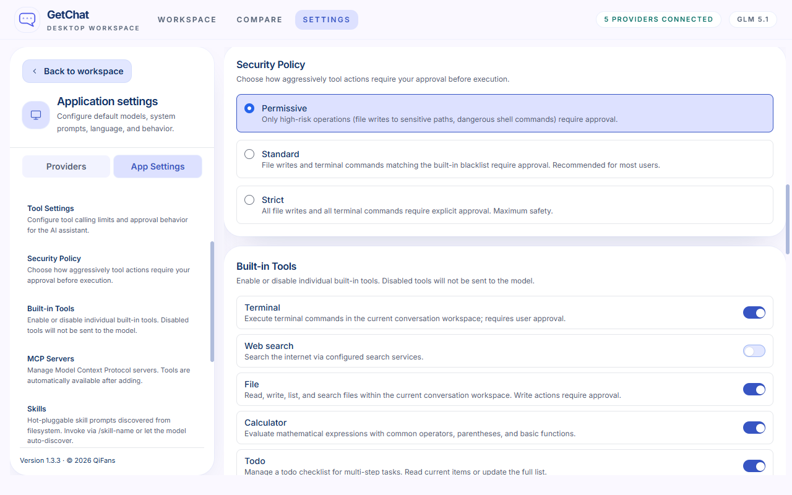

<div align="center">


# GetChat

**Get inspiration, get creativity, get infinite possibilities.**

一款本地优先的桌面端 AI 对话应用——每一段对话都是一棵树，而不是一条线。随时分叉、并排对比，再也不会弄丢一个好想法。

[](#)
[](#)
[](#)
[](https://www.typescriptlang.org/)
[](https://react.dev/)
[](https://tauri.app/)
[](./LICENSE)

[English](./README.md) · [简体中文](./README.zh-CN.md)

</div>

---

## 痛点

你一定经历过这种时刻：和 AI 聊到深处，回答已经很好了，但还想再调调——于是你改了提示词重新生成，原来的回答就没了。或者你想换个思路，整个上下文全部重置。

大多数 AI 对话工具把会话当成一条直线。走错一步，之前的工作就找不回来了。

## 想法

**如果每段对话都是一棵树，而不是一条线呢？**

GetChat 让你从任意消息处分叉——就像给思路建一个 Git 分支，但这是你的思考过程。原路径永远不会被破坏。你可以自由探索，并排对比，最后把最满意的那条路径设为主线。

## 应用截图

<p align="center">
  
</p>
<p align="center"><em>应用首页 — 左侧侧边栏管理多个会话</em></p>

<p align="center">
  
</p>
<p align="center"><em>对话页面 — 项目文件侧边栏 + 实时上下文状态查看</em></p>

<p align="center">
  
</p>
<p align="center"><em>分支面板 — 直接在分支视图上管理（重命名、归档、删除）</em></p>

<p align="center">
  
</p>
<p align="center"><em>对比模式 — 并排查看差异，AI 自动总结减轻对比压力</em></p>

<p align="center">
  
</p>
<p align="center"><em>设置页面 — 安全权限控制、内置工具开关、MCP 与 Skills 配置</em></p>

## 能做什么？

### 随处分叉

聊到一半觉得可以换个方向？点一下就分叉。想用不同模型回答同一个问题？重新生成只创建候选回答，不会碰原始内容。你的每一步探索都是无损的。

### 并排对比分支

选两条分支，分屏查看。共享的上下文会高亮显示，让你一眼看到差异。还有 AI 驱动的差异总结，帮你决定哪条路径更好。

### 工具调用 & MCP 集成

让 AI 在对话中调用工具和外部服务。连接任意 MCP（模型上下文协议）服务器——网页搜索、代码执行、文件访问等等。工具以内联卡片形式展示，带审批控制，你对机器上运行的一切保持掌控。

### Skills 系统

基于文件系统的热插拔技能发现。将 `SKILL.md` 文件放入技能目录即可立即生效——无需重启、无需数据库。采用渐进式披露架构：元数据始终对模型可见以实现自动发现，完整内容按需加载，斜杠命令提供快速激活。你的 AI 助手随你的工作流而变。

### 上下文管理

通过可视化进度条实时追踪 token 使用情况。上下文窗口大小根据每个模型的限制动态计算。当上下文过长时，GetChat 可以自动压缩——你也可以随时手动触发压缩。

### 富文本 Markdown 渲染

AI 回复会以精美的 Markdown 呈现：30+ 种语言的语法高亮代码块、LaTeX 数学公式、Mermaid 图表、表格……用户消息也一样渲染——你的文字也值得好看。

### 连接任意模型

OpenAI、DeepSeek、Ollama、OpenRouter、Groq，或者任何兼容 OpenAI 协议的 API。想加几个 Provider 就加几个，设一个默认模型方便快速聊天，或者在不同分支用不同模型。本地 Ollama 开箱即用。

### 数据在你手中

所有数据存在本地 SQLite 数据库里。没有云同步、没有遥测、没有账号注册。离开你电脑的网络请求，只有你配好的 AI API 调用。你的对话留在它该在的地方。

### 小而快

基于 Tauri v2（Rust 后端），不是 Electron。应用轻量、秒开、内存占用极低。Windows、macOS、Linux 原生运行。

### 键盘优先

快捷键全覆盖：发消息、切换会话、浏览分支——不用摸鼠标。

### 多语言

开箱支持中文和英文，随时在设置中切换。

## 快速上手

### 普通用户

去 [Releases 页面](https://github.com/qifanet/GetChat/releases) 下载你系统的安装包就行。

### 开发者

```bash
git clone https://github.com/qifanet/GetChat.git
cd GetChat
npm install
npx tauri dev
```

你需要 [Node.js](https://nodejs.org/) 18+、[Rust](https://www.rust-lang.org/tools/install) 稳定版工具链，以及 [Tauri v2 平台依赖](https://tauri.app/start/prerequisites/)。

### 从源码构建

```bash
npx tauri build
```

安装包会生成在 `src-tauri/target/release/bundle/`。

## 技术栈

| 层级 | 技术 |
|------|------|
| 前端 | React 19, TypeScript (strict), Zustand, Tailwind CSS |
| 后端 | Tauri v2, Rust, SQLite (sqlx) |
| AI | OpenAI 兼容 API, MCP 协议 |
| 构建 | Vite, Cargo |

## 参与贡献

欢迎贡献！请阅读 [贡献指南](./CONTRIBUTING.md) 了解分支命名规范、提交格式和 PR 流程。

## 许可证

[MIT License](./LICENSE) — 随便用、随便改、随便发。

---

<div align="center">

Built with care by [QiFans](https://github.com/qifanet)

</div>
