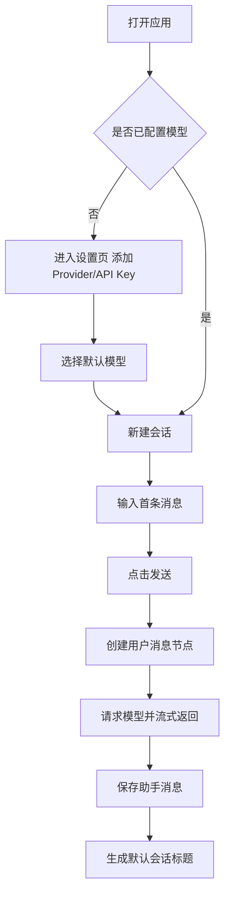
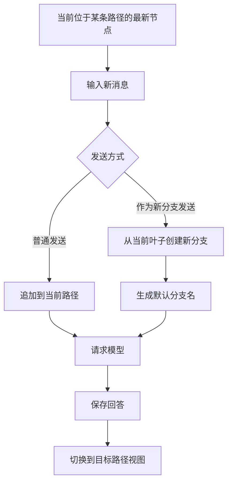
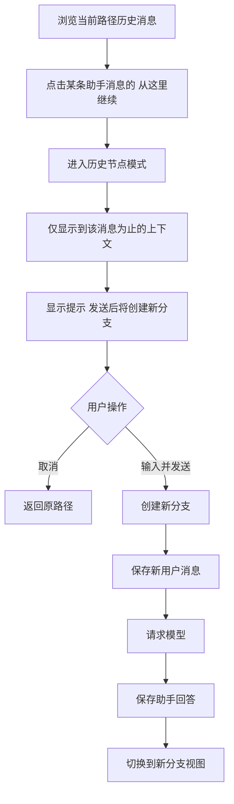
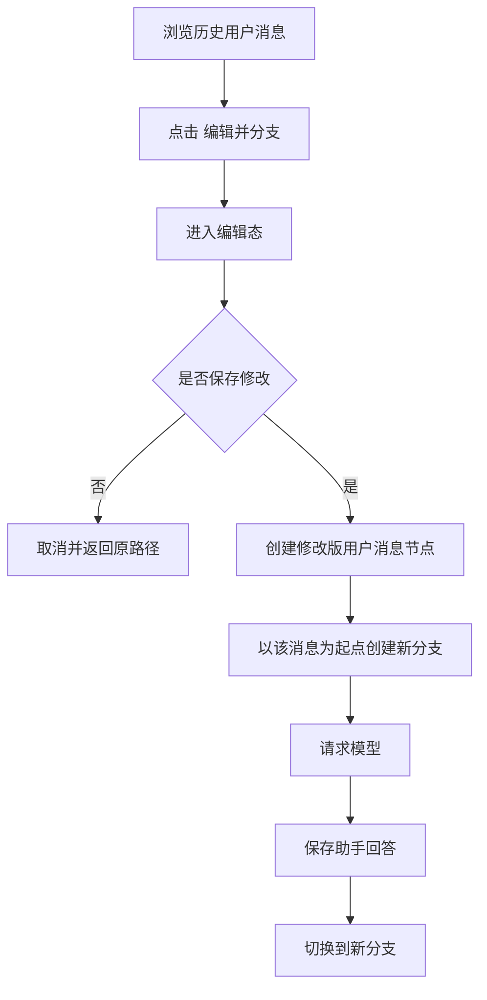
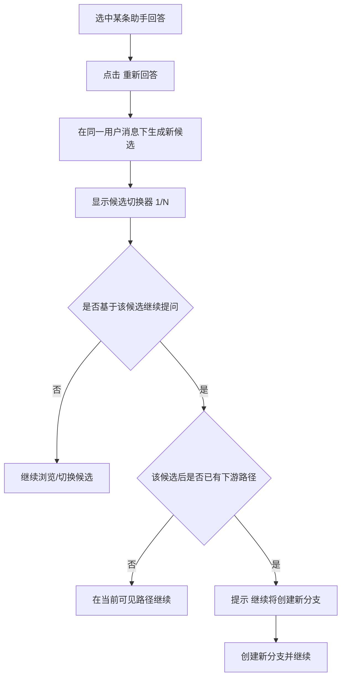
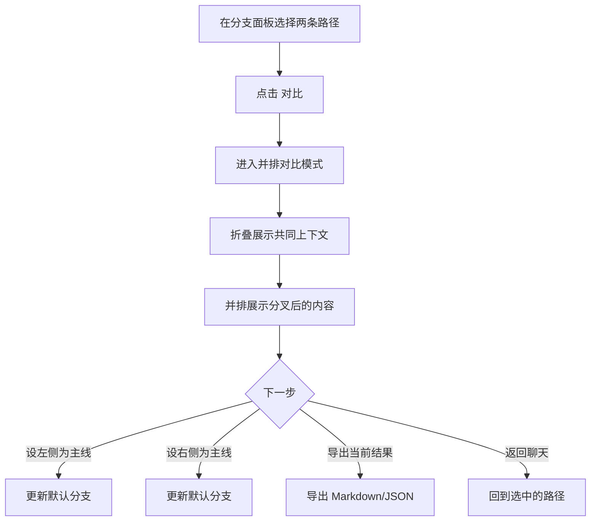

下面我直接按**可落地的 v1 方案**来产出，默认采用这些前置决策：

- **产品定位**：AI 探索工作台，不是普通聊天壳
- **平台**：桌面端（macOS / Windows）
- **形态**：本地优先（local-first）
- **商业模式**：v1 先做 **BYOK**
- **模型接入**：v1 先支持 **OpenAI-compatible**，接口层预留 Ollama
- **交互原则**：**默认线性，按需显露树状**
- **核心闭环**：**分叉 → 导航 → 比较 → 设主线/导出**

---

# 一、v1 PRD

## 1.1 文档摘要

| 项目       | 内容                                                       |
| ---------- | ---------------------------------------------------------- |
| 产品代号   | BranchFlow                                                 |
| 版本       | v1.0                                                       |
| 平台       | Desktop（macOS / Windows）                                 |
| 产品一句话 | 一个支持从任意消息分叉、比较和收敛的本地优先 AI 对话工作台 |
| 目标用户   | AI 重度用户：产品经理、内容创作者、开发者                  |
| 商业模式   | BYOK（用户自带 API Key）                                   |
| 核心卖点   | 任意消息分支、历史回溯、候选回答、路径对比、主线收敛       |
| 设计原则   | 线性优先、非破坏性、状态明确、本地优先                     |

---

## 1.2 背景与问题

现有 AI 对话产品大多是**线性聊天**。当用户想探索多个方向时，只能：

- 复制到新会话
- 编辑旧消息重问
- 重复 regenerate
- 开多个窗口手动比对

这会带来几个问题：

1. **上下文割裂**：不同路线散落在多个会话里
2. **过程不可追溯**：很难知道“我是从哪一步分出去的”
3. **比较成本高**：多个方案不能并排比较
4. **收敛困难**：最后无法沉淀“哪条路线最好”

本产品 v1 要解决的不是“聊天更多”，而是：

> **让用户在同一个会话内低成本探索多个可能性，并最终选出更优结果。**

---

## 1.3 目标用户与核心场景

### 核心用户

| 用户      | 高频任务                     | 当前痛点               | 本产品价值                 |
| --------- | ---------------------------- | ---------------------- | -------------------------- |
| 产品经理  | PRD、方案推演、竞品分析      | 多思路切换混乱         | 从任意节点分叉并比较方案   |
| 内容/运营 | 多版文案、标题、脚本         | 多风格版本难管理       | 候选回答 + 分支收敛        |
| 开发者    | 架构讨论、代码方案、调试思路 | 同问题多路线易丢上下文 | 保留分叉历史并回到任一路线 |

### 核心 JTBD

1. **当我在和 AI 探索多个方向时**，我希望能从任意消息快速开新路线，而不破坏原对话。
2. **当我回看复杂会话时**，我希望清楚知道每条路线从哪里分出来、最后走到了哪里。
3. **当我需要做选择时**，我希望能并排比较两条路径，并设定哪条作为主线。

---

## 1.4 产品目标 / 非目标

### 产品目标

1. 用户可以从**任意消息**创建新分支
2. 用户可以在**同一会话**中管理多条探索路径
3. 用户可以比较两条路径并**设为主线**
4. 产品的学习成本尽量接近普通聊天工具

### 非目标（v1 不做）

- 团队协作
- 云同步
- 知识库 / RAG
- 插件 / Agent 自动执行
- 图片 / 语音 / 文件多模态
- 团队计费和代充 token 平台

---

## 1.5 核心概念定义

| 概念                  | 定义                                                     |
| --------------------- | -------------------------------------------------------- |
| 会话 Conversation     | 一个完整的探索主题，底层是消息树                         |
| 主线 Default Path     | 会话默认打开的路径，类似“当前结论路线”                   |
| 当前路径 Current Path | 用户此刻正在浏览/编辑的路径，不一定是主线                |
| 分叉点 Fork Point     | 某条路径开始偏离原路线的消息节点                         |
| 分支 Branch           | 从某个消息节点延展出来的一条独立探索路径                 |
| 候选回答 Variant      | 针对同一条用户消息生成的多个助手回答，不默认等于完整分支 |

### 分支与候选的区别

```text
用户消息 Q1
├─ 助手回答 A1（候选1）
│  └─ 后续路径 ...
└─ 助手回答 A2（候选2）
```

- **A1 / A2** 是“候选回答”
- 当用户基于 A2 继续提问并走下去时，才形成更明确的“分支路径”

---

## 1.6 MVP 核心闭环

```text
普通对话
→ 从任意消息分叉 / 重新回答
→ 在分支间切换
→ 并排比较两条路径
→ 设为主线 / 导出结果
```

---

## 1.7 版本范围

### P0（v1 必做）

- 会话列表
- BYOK 配置（OpenAI-compatible）
- 普通聊天
- Markdown / 代码块渲染
- 从最新消息“作为新分支发送”
- 从历史助手消息“从这里继续”
- 编辑历史用户消息并分支
- 重新回答生成候选回答
- 分支面板与路径切换
- 比较两条路径
- 设为主线
- 导出 Markdown / JSON
- 本地存储
- API Key 本地安全存储

### P1（v1.1 候选）

- AI 自动生成会话标题 / 分支标题
- Ollama 支持
- AI 总结两条分支差异
- 全文搜索整棵会话树
- 多模型并行生成多个候选
- PDF / HTML 导出

### Out of Scope

- 协作编辑
- 评论 / 审批流
- 云端账户体系
- 插件市场
- RAG 和 Agent

---

## 1.8 功能需求清单

## FR-01 模型配置

| 项目     | 要求                                                         |
| -------- | ------------------------------------------------------------ |
| 目标     | 让用户完成首次可用配置                                       |
| 功能     | 添加 Provider、Base URL、API Key、模型名；支持设置默认模型   |
| 规则     | v1 至少支持 OpenAI-compatible；API Key 使用系统 Keychain/加密存储 |
| 验收标准 | 用户首次启动后可在 2 分钟内完成配置并发出第一条消息          |

---

## FR-02 会话管理

| 项目     | 要求                                       |
| -------- | ------------------------------------------ |
| 功能     | 新建会话、重命名、归档、删除               |
| 默认标题 | 使用首条用户消息前 20 字作为默认标题       |
| 列表排序 | 按最近更新时间倒序                         |
| 状态标识 | 有分支的会话显示分支标记                   |
| 验收标准 | 用户可快速切换历史会话，关闭重开后数据保留 |

---

## FR-03 聊天工作区

| 项目     | 要求                                                 |
| -------- | ---------------------------------------------------- |
| 显示方式 | 中间仅显示**当前路径**，不默认展开整棵树             |
| 消息渲染 | 支持 Markdown、代码块、复制、流式输出、停止生成      |
| 输入区   | 支持普通发送；支持“发送 ▼”下拉菜单                   |
| 高级参数 | 至少支持模型选择；温度等参数可放入折叠高级设置       |
| 验收标准 | 普通聊天体验接近 ChatGPT，不因分支能力破坏基础可用性 |

---

## FR-04 从最新节点“作为新分支发送”

| 项目     | 要求                                                         |
| -------- | ------------------------------------------------------------ |
| 触发方式 | 输入框发送按钮下拉菜单：`发送` / `作为新分支发送`            |
| 行为     | 若选择“作为新分支发送”，系统从当前叶子节点创建新分支，原主线保持不变 |
| 命名     | 自动生成默认分支名（如取首句摘要），允许后续手动改名         |
| 验收标准 | 用户能在 2 步内从当前最新上下文快速开启另一条路线            |

---

## FR-05 从历史助手消息继续（分支）

| 项目     | 要求                                                       |
| -------- | ---------------------------------------------------------- |
| 触发方式 | 助手消息 hover / 右键操作：`从这里继续`                    |
| 中间态   | 进入“历史节点模式”，聊天区仅显示到该消息为止               |
| 状态提示 | 顶部固定提示条：`你正在从历史消息继续，发送后将创建新分支` |
| 创建时机 | 只有在用户真正发送新消息后，才正式创建分支                 |
| 验收标准 | 原路径不被覆盖；取消后可完整回到原路径                     |

---

## FR-06 编辑历史用户消息并分支

| 项目     | 要求                                                         |
| -------- | ------------------------------------------------------------ |
| 触发方式 | 用户消息 hover / 右键操作：`编辑并分支`                      |
| 行为     | 对历史用户消息进行修改，保存后以该修改版消息生成新路径       |
| 规则     | 原消息不可直接覆盖；仅用户消息允许编辑，助手消息 v1 不支持编辑 |
| 验收标准 | 修改旧 prompt 后，原路径完整保留，新路径独立生成             |

---

## FR-07 重新回答 / 候选回答

| 项目     | 要求                                                         |
| -------- | ------------------------------------------------------------ |
| 触发方式 | 助手消息下方：`重新回答`                                     |
| 行为     | 在同一条用户消息下生成新的助手候选回答                       |
| UI       | 候选以 `1 / N` 分页或小切换器展示                            |
| 规则     | 原回答不被覆盖；如用户基于某个候选继续提问，必要时转为新分支 |
| 验收标准 | 同一问题可保留多个回答版本，并能继续沿其中任一路线深入       |

---

## FR-08 分支导航面板

| 项目     | 要求                                                         |
| -------- | ------------------------------------------------------------ |
| 位置     | 右侧边栏，默认可折叠                                         |
| 内容     | 分支树/分支列表、分叉来源、更新时间、当前状态、主线标记      |
| 操作     | 打开分支、重命名、设为主线、归档                             |
| 辅助提示 | 在有分叉的消息旁显示 `2 条后续路线`；有候选回答的消息显示 `3 个候选` |
| 验收标准 | 用户可随时知道“我现在在哪条路线”以及“其他路线在哪里”         |

---

## FR-09 路径对比模式

| 项目     | 要求                                                 |
| -------- | ---------------------------------------------------- |
| 进入方式 | 在分支面板勾选两条路径后点击 `对比`                  |
| 对比范围 | v1 仅支持同一会话内两条路径对比                      |
| 显示方式 | 顶部折叠共同上下文，下方并排展示分叉后的内容         |
| 模式规则 | 对比模式下输入区禁用，只读浏览                       |
| 后续动作 | 设左侧/右侧为主线、返回某条路径、导出                |
| 验收标准 | 用户能明确看出两条路线差异，并完成“选择一条作为主线” |

---

## FR-10 收敛与导出

| 项目     | 要求                                                     |
| -------- | -------------------------------------------------------- |
| 收敛动作 | 将某条分支设为主线（默认打开路径）                       |
| 导出     | 导出当前路径为 Markdown；导出整个会话树为 JSON           |
| 规则     | 设为主线不删除其他分支；导出 whole tree 时保留分支元数据 |
| 验收标准 | 用户可将最终结果沉淀为主线，并带走内容结果               |

---

## FR-11 本地存储与安全

| 项目     | 要求                                 |
| -------- | ------------------------------------ |
| 数据存储 | 本地数据库保存会话、消息树、分支信息 |
| 恢复能力 | 应用重启后可完整恢复                 |
| 离线能力 | 未联网时仍可浏览本地历史             |
| 安全     | API Key 不明文落盘                   |
| 验收标准 | 本地数据稳定、可恢复，适合重度使用   |

---

## FR-12 异常处理

| 场景         | 要求                         |
| ------------ | ---------------------------- |
| API Key 无效 | 明确提示并引导到设置页       |
| 请求失败     | 失败消息就地提示，支持重试   |
| 流式中断     | 保留已收到内容并允许重新请求 |
| 分支切换失败 | 不丢当前页面状态，提示后恢复 |
| 验收标准     | 错误不应破坏消息树和分支结构 |

---

## 1.9 核心 UX 规则

### 规则 1：默认线性，按需显露树状
- 中间主区域永远优先展示**当前路径**
- 分支树只在右侧边栏中展示

### 规则 2：所有历史操作都非破坏性
- 编辑旧消息 ≠ 覆盖旧消息
- 重答 ≠ 替换原回答
- 设为主线 ≠ 删除其他分支

### 规则 3：用户必须知道自己在哪
界面必须始终展示：
- 当前路径名
- 是否是主线
- 分叉来源
- 当前是否处于“历史节点模式”

### 规则 4：把“候选回答”和“分支路径”区分开
- 候选回答用于轻量比较
- 分支路径用于继续探索

---

## 1.10 关键状态机

| 状态           | 触发方式           | 中间区显示                           | 输入区行为                |
| -------------- | ------------------ | ------------------------------------ | ------------------------- |
| 正常模式       | 打开某条路径       | 完整当前路径                         | `发送` / `作为新分支发送` |
| 历史节点模式   | 点击“从这里继续”   | 仅显示到选中节点                     | `创建分支并发送`          |
| 编辑并分支模式 | 点击“编辑并分支”   | 选中用户消息进入编辑态，后续消息隐藏 | 保存后发送                |
| 候选预览模式   | 切换到其他候选回答 | 显示选中的候选；必要时隐藏后续路径   | 若继续则创建分支          |
| 对比模式       | 选择两条路径对比   | 并排展示两条路径                     | 输入区禁用                |

---

## 1.11 成功指标

### 定性指标
- 目标用户能理解“分支”和“候选回答”的区别
- 用户能独立完成三项任务：
  1. 从历史消息创建分支
  2. 比较两条路径
  3. 设一条路径为主线

### 定量指标（内测建议）
- ≥ 60% 的活跃会话产生至少 1 次分支操作
- ≥ 30% 的分支会话使用过对比模式
- ≥ 20% 的分支会话完成“设为主线”或导出
- 首次可用配置完成率 ≥ 80%

---

## 1.12 主要风险与缓解

| 风险     | 说明                 | 缓解方案                           |
| -------- | -------------------- | ---------------------------------- |
| 分支爆炸 | 分支一多用户会迷路   | 默认线性 + 右侧折叠树 + 主线机制   |
| 概念复杂 | 用户分不清候选和分支 | UI 与术语严格区分                  |
| 迁移成本 | 用户习惯普通聊天工具 | 聊天主界面保持熟悉，树状只按需出现 |
| 配置门槛 | BYOK 增加上手成本    | 做好首次启动引导和 Provider 模板   |

---

# 二、信息架构

## 2.1 产品级信息架构

```text
App
├─ 首次启动 / 空状态
│  ├─ 添加 Provider
│  ├─ 设置默认模型
│  └─ 新建第一条会话
├─ 会话列表
│  ├─ 最近会话
│  ├─ 已归档会话
│  └─ 删除会话
├─ 会话工作区
│  ├─ 顶部栏
│  │  ├─ 会话标题
│  │  ├─ 当前路径面包屑
│  │  ├─ 主线标记
│  │  ├─ 对比
│  │  └─ 导出
│  ├─ 聊天流（仅当前路径）
│  ├─ 输入区
│  │  ├─ 模型选择
│  │  ├─ 高级参数
│  │  └─ 发送 / 作为新分支发送
│  └─ 右侧边栏
│     ├─ 分支
│     └─ 详情
├─ 对比模式
│  ├─ 对比头部
│  ├─ 共同上下文
│  └─ 双栏差异内容
└─ 设置
   ├─ Providers
   ├─ Models
   ├─ General
   └─ Data & Export
```

---

## 2.2 主工作台布局

```text
┌──────────────────────────────────────────────────────────────────────────────┐
│ 左侧栏                    │ 顶部栏                                          │
│                            │ 会话标题 | 当前路径: 主线 > 分支A | 对比 | 导出 │
├───────────────────────────┼───────────────────────────────────────┬─────────┤
│ + 新建会话                 │ 当前路径聊天流                          │ 右侧边栏 │
│ 最近会话                   │ [用户] 需求描述...                      │ [分支]   │
│ - 会话 1 (3 branches)      │ [助手] 方案A...  2个候选                │ - 主线    │
│ - 会话 2                   │ [用户] 继续细化...                      │ - 分支A   │
│ 已归档                     │ [助手] ...                              │ - 分支B   │
│ 设置                       │                                          │ [详情]   │
│                            │ 历史模式提示条/候选提示条（按状态出现） │          │
├───────────────────────────┴───────────────────────────────────────┴─────────┤
│ 模型选择 | 参数 | 输入框...                                         | 发送 ▼   │
└──────────────────────────────────────────────────────────────────────────────┘
```

---

## 2.3 对比模式布局

```text
┌──────────────────────────────────────────────────────────────────────────────┐
│ 返回 | 对比分支A vs 主线 | 展开共同上下文 | 设左侧为主线 | 设右侧为主线 | 导出 │
├──────────────────────────────────────────────────────────────────────────────┤
│ 共同上下文（默认折叠，可展开）                                                │
├───────────────────────────────────────┬──────────────────────────────────────┤
│ 左侧路径：主线                        │ 右侧路径：分支A                      │
│ [分叉后的消息1]                       │ [分叉后的消息1]                      │
│ [分叉后的消息2]                       │ [分叉后的消息2]                      │
│ [分叉后的消息3]                       │ [分叉后的消息3]                      │
└───────────────────────────────────────┴──────────────────────────────────────┘
```

---

## 2.4 消息级交互矩阵

| 对象       | 可用动作                               |
| ---------- | -------------------------------------- |
| 用户消息   | 编辑并分支、复制                       |
| 助手消息   | 从这里继续、重新回答、复制、加入对比   |
| 候选回答组 | 切换候选、基于该候选继续               |
| 分叉点消息 | 查看相关分支                           |
| 分支卡片   | 打开、重命名、设为主线、归档、加入对比 |

---

## 2.5 核心对象关系

| 对象         | 说明                 | 关键关系                  |
| ------------ | -------------------- | ------------------------- |
| Conversation | 一个探索主题         | 1 个会话包含多条路径      |
| MessageNode  | 树中的单条消息       | 每条消息有 parent_id      |
| BranchRef    | 对某条路径的命名引用 | 指向 fork 节点与当前 head |
| ModelConfig  | 模型配置             | 会话/消息可关联模型参数   |

### 建议的对象关系理解

```text
Conversation
├─ Main Branch（主线）
│  └─ Head Node
├─ Branch A
│  └─ Head Node
└─ Branch B
   └─ Head Node

底层实际是共享消息树，不是重复复制整段对话。
```

---

# 三、关键交互流程图

下面给你 6 条 v1 最关键流程。

---

## 3.1 首次启动与第一条消息



---

## 3.2 在当前最新节点“作为新分支发送”



**解释**：这条流程满足“从新消息直接开分支”的核心诉求。

---

## 3.3 从历史助手消息“从这里继续”



---

## 3.4 编辑历史用户消息并分支



---

## 3.5 对助手回答“重新回答”生成候选



**解释**：v1 里候选回答是轻量“版本”，继续走下去才变成更完整的“路径”。

---

## 3.6 比较两条路径并设为主线



---

# 四、这个 v1 的一句话验收标准

如果一个目标用户能顺畅完成下面 3 件事，这个 v1 就是合格的：

1. **从历史消息开出新分支**
2. **比较两条路线差异**
3. **把其中一条设为主线并导出**

---
