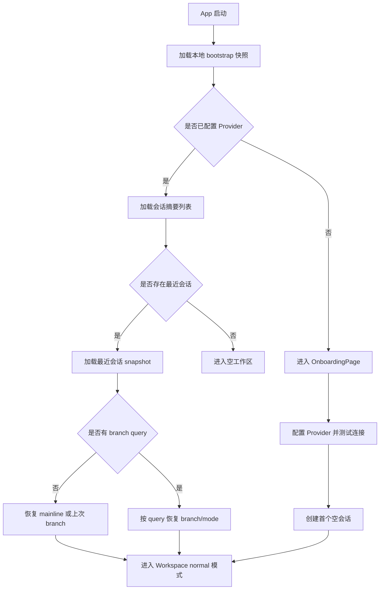
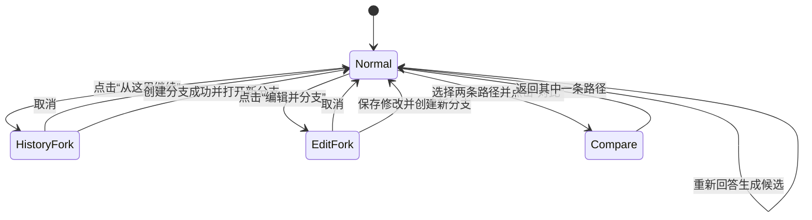
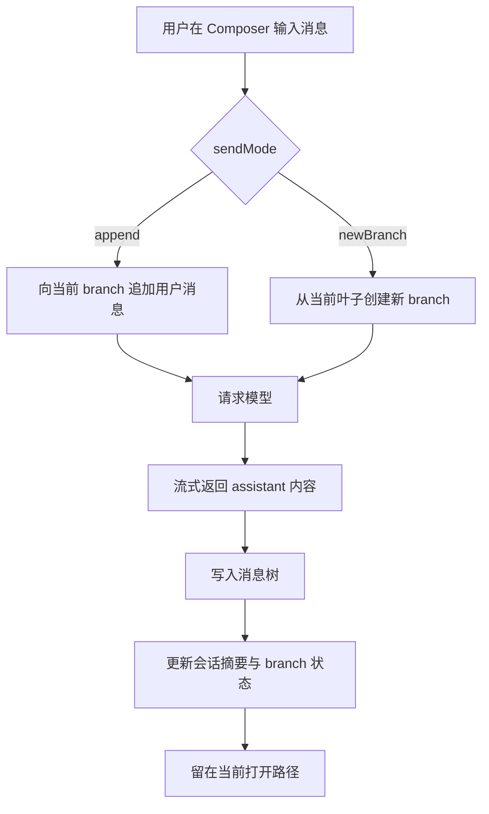
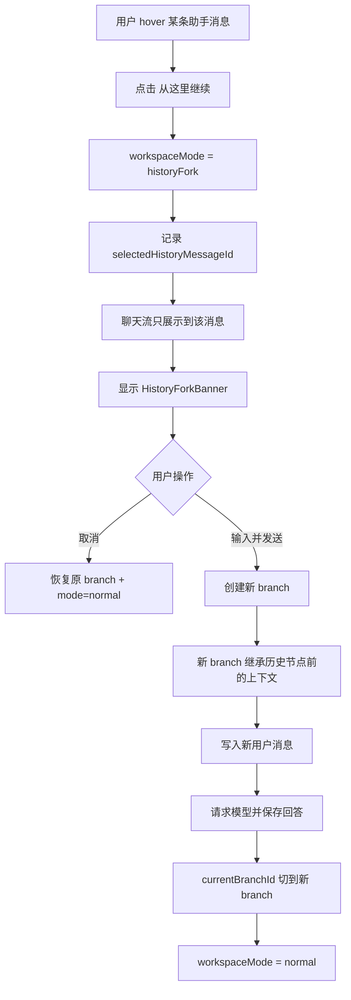
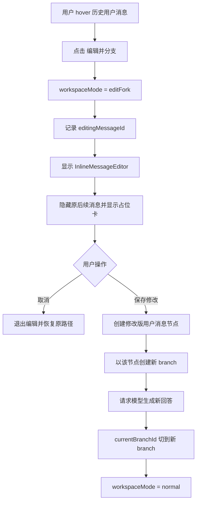
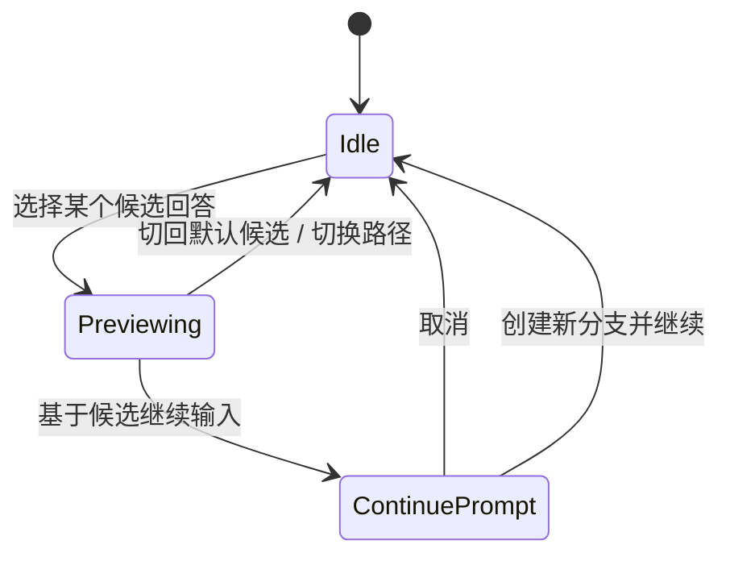
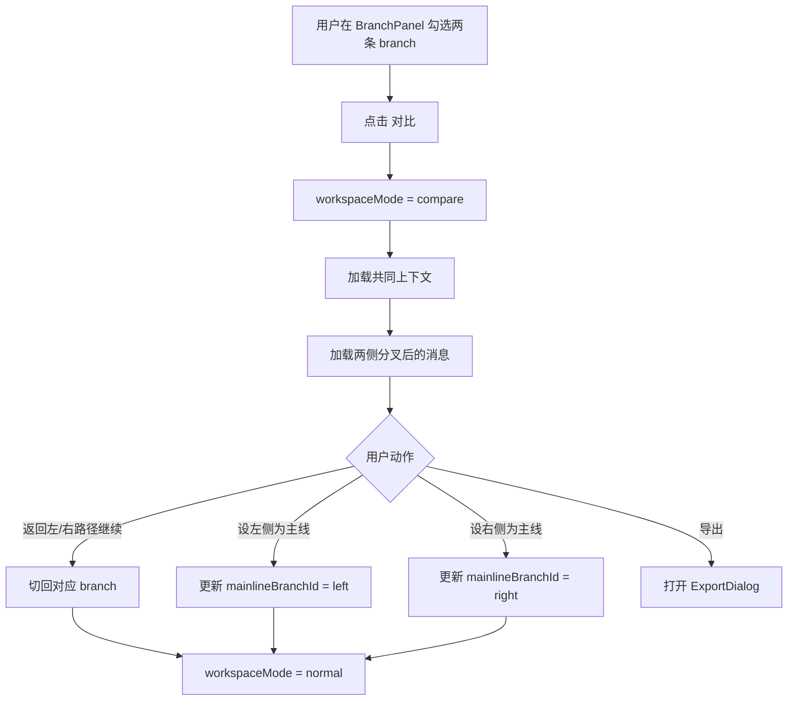
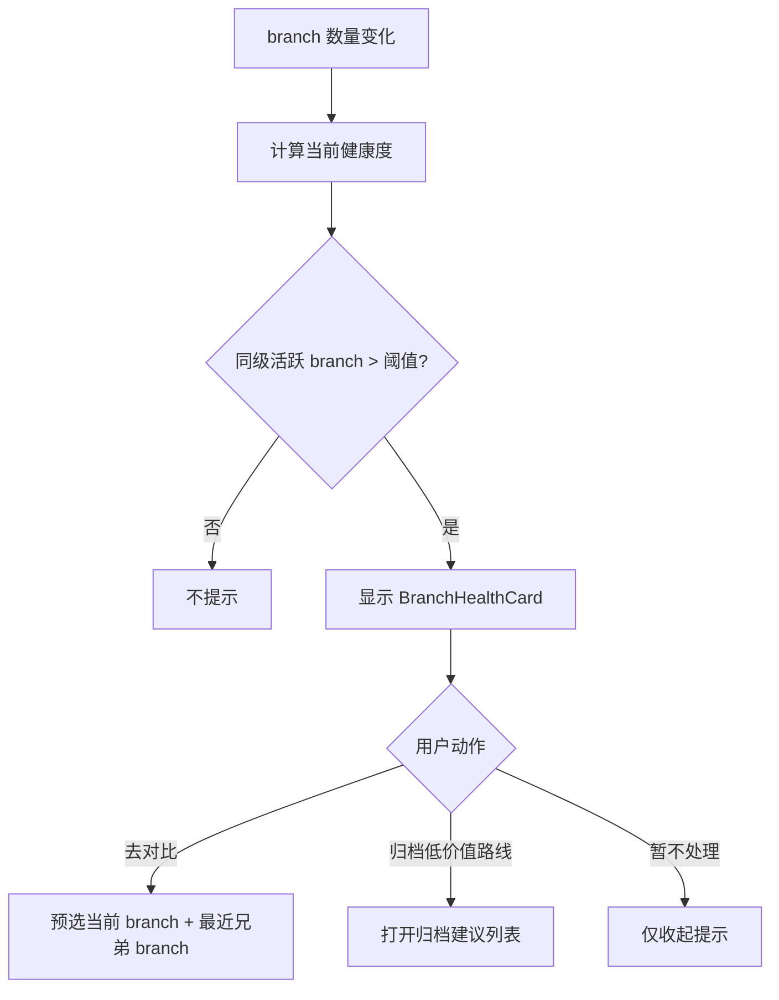

好，我们继续往**可直接落地开发**的层级推进。

下面这份内容的目标不是再讲概念，而是让你可以：

- 直接搭 React/Tauri 的前端骨架
- 用 AI 辅助生成组件和页面框架
- 避免后面因为“状态散落 / 分支逻辑打架 / 页面越来越乱”而返工

我会按这 4 部分输出：

1. **前端实现边界与状态分层**
2. **前端组件树（React/Tauri 版）**
3. **页面状态流转图**
4. **关键事件清单**

---

# 一、前端实现边界与状态分层

先给你一个很重要的落地建议：

> **不要让 React 组件直接到处调用 Tauri invoke / 模型请求。**
> 要把前端拆成：**UI 层 → Feature Action 层 → Store 层 → Service/Tauri 层**

这样 AI 辅助开发时，不会越写越乱。

---

## 1.1 推荐前端分层

```text
UI Components
↓
Feature Actions / Hooks
↓
Store（状态管理）
↓
Services（模型请求 / Tauri command / 本地存储）
```

---

## 1.2 推荐状态分层

建议至少拆 5 个 store，不要全塞一个。

### A. `appStore`
负责全局应用状态

- 是否完成启动初始化
- 是否有可用 Provider
- 当前路由恢复状态
- 最后打开的会话/分支

### B. `conversationStore`
负责会话与消息树数据

- 会话列表
- 当前会话的消息树
- branch summaries
- mainline branch id
- message nodes / variant groups

### C. `workspaceStore`
负责当前工作区模式与路径上下文

- `workspaceMode`
- `activeConversationId`
- `currentBranchId`
- `selectedHistoryMessageId`
- `editingMessageId`
- `compareBranchIds`
- `variantPreviewContext`
- `pendingConvergeCount`

### D. `composerStore`
负责输入区状态

- draft
- selectedModel
- sendMode
- advanced params
- streaming status
- stop generating state

### E. `uiStore`
负责纯 UI 交互状态

- left sidebar collapsed
- right panel collapsed
- right panel active tab
- dialogs
- toasts

---

## 1.3 推荐工作区模式定义

这个很关键，建议从一开始就固定。

```ts
type WorkspaceMode =
  | "normal"
  | "historyFork"
  | "editFork"
  | "compare";
```

### 额外子状态
候选回答不要升格成完整页面模式，做成消息级子状态即可。

```ts
type VariantPreviewContext = {
  messageId: string | null;
  variantId: string | null;
  hidesDownstream: boolean;
};
```

---

## 1.4 路由建议

桌面端不需要复杂路由，但建议保留最基本的页面级路由。

```text
/onboarding
/workspace/:conversationId?
/settings
```

### 可选 query 参数
建议工作区状态部分镜像到 query，便于恢复：

```text
/workspace/conv_001?branch=br_main
/workspace/conv_001?branch=br_a&mode=compare&left=br_main&right=br_a
```

### 为什么这样做
- 重启后状态恢复更稳
- AI 辅助开发更容易调试
- 不把所有状态都塞进内存 store

---

## 1.5 推荐目录结构

```text
src/
├─ app/
│  ├─ App.tsx
│  ├─ router.tsx
│  ├─ providers/
│  │  ├─ AppBootstrapProvider.tsx
│  │  ├─ StoreProvider.tsx
│  │  └─ ToastProvider.tsx
│  └─ layouts/
│     ├─ RootLayout.tsx
│     └─ WorkspaceLayout.tsx
├─ pages/
│  ├─ OnboardingPage.tsx
│  ├─ WorkspacePage.tsx
│  └─ SettingsPage.tsx
├─ features/
│  ├─ onboarding/
│  ├─ conversations/
│  ├─ workspace/
│  ├─ messages/
│  ├─ branches/
│  ├─ variants/
│  ├─ composer/
│  ├─ compare/
│  ├─ settings/
│  └─ export/
├─ components/
│  ├─ layout/
│  ├─ common/
│  ├─ feedback/
│  └─ forms/
├─ stores/
│  ├─ appStore.ts
│  ├─ conversationStore.ts
│  ├─ workspaceStore.ts
│  ├─ composerStore.ts
│  └─ uiStore.ts
├─ services/
│  ├─ tauriCommands.ts
│  ├─ modelClient.ts
│  ├─ conversationService.ts
│  ├─ branchService.ts
│  └─ exportService.ts
├─ selectors/
│  ├─ conversationSelectors.ts
│  ├─ branchSelectors.ts
│  └─ compareSelectors.ts
├─ types/
│  ├─ app.ts
│  ├─ conversation.ts
│  ├─ branch.ts
│  ├─ message.ts
│  └─ workspace.ts
└─ utils/
```

---

# 二、前端组件树（React/Tauri 版）

下面给你两种视角：

1. **运行时组件树**
2. **组件职责与状态依赖**

---

## 2.1 顶层运行时组件树

```text
<App>
└─ <AppProviders>
   ├─ <AppBootstrapProvider>
   ├─ <StoreProvider>
   ├─ <ToastProvider>
   └─ <Router>
      ├─ <OnboardingPage />
      ├─ <WorkspacePage />
      └─ <SettingsPage />
```

---

## 2.2 `WorkspacePage` 运行时组件树

这是最核心的。

```text
<WorkspacePage>
└─ <WorkspaceLayout>
   ├─ <ConversationSidebar />
   │  ├─ <SidebarHeader />
   │  ├─ <NewConversationButton />
   │  ├─ <ConversationListSection title="最近会话" />
   │  │  └─ <ConversationListItem />*
   │  ├─ <ArchivedConversationSection />
   │  └─ <SidebarFooter />
   │
   ├─ <WorkspaceMain>
   │  ├─ <TopContextBar />
   │  │  ├─ <ConversationTitle />
   │  │  ├─ <PathBreadcrumb />
   │  │  ├─ <MainlineBadge />
   │  │  ├─ <PendingConvergePill />
   │  │  ├─ <CompareEntryButton />
   │  │  └─ <ExportEntryButton />
   │  │
   │  ├─ <WorkspaceModeOutlet>
   │  │  ├─ <EmptyConversationState />            // 无消息时
   │  │  ├─ <ChatWorkspace />                     // normal/historyFork/editFork
   │  │  └─ <CompareWorkspace />                  // compare
   │  │
   │  └─ <ComposerDock />                         // compare 模式下禁用或隐藏
   │     ├─ <ModelSelector />
   │     ├─ <AdvancedParamsPopover />
   │     ├─ <ComposerInput />
   │     ├─ <SendModeDropdown />
   │     ├─ <SendButton />
   │     └─ <StopGeneratingButton />
   │
   └─ <RightPanelContainer>
      ├─ <RightPanelTabs />                       // branches / details（details可后置）
      └─ <BranchPanel />
         ├─ <BranchPanelHeader />
         │  ├─ <BranchFilterTabs />
         │  └─ <CollapseAllButton />
         ├─ <CurrentPathCard />
         ├─ <SiblingBranchSection />
         │  └─ <BranchListItem />*
         ├─ <BranchHealthCard />
         ├─ <OtherActiveBranchSection />
         └─ <ArchivedBranchSection />
```

---

## 2.3 `ChatWorkspace` 组件树

```text
<ChatWorkspace>
├─ <WorkspaceBannerRegion>
│  ├─ <HistoryForkBanner />      // mode=historyFork
│  ├─ <EditForkBanner />         // mode=editFork
│  └─ <VariantPreviewBanner />   // 可选，variant preview 时显示
│
├─ <ChatThread>
│  ├─ <TurnBlock />*
│  │  ├─ <UserMessageBubble />
│  │  │  ├─ <MessageHeader />
│  │  │  ├─ <MarkdownRenderer />
│  │  │  └─ <MessageActionMenu />   // 编辑并分支、复制
│  │  │
│  │  └─ <AssistantMessageBubble />
│  │     ├─ <MessageHeader />
│  │     ├─ <MarkdownRenderer />
│  │     ├─ <CodeBlockActions />
│  │     ├─ <VariantSwitcher />     // 同一用户消息下的多个候选
│  │     ├─ <MessageMetaBar />
│  │     │  ├─ <VariantHintBadge />
│  │     │  ├─ <BranchHintBadge />
│  │     │  └─ <ForkSourceChip />
│  │     └─ <MessageActionMenu />   // 从这里继续、重新回答、复制
│  │
│  ├─ <DownstreamHiddenCard />      // historyFork/editFork 时隐藏原后续
│  ├─ <InlineMessageEditor />       // editFork 时嵌入
│  └─ <StreamingStatusInline />
│
└─ <ScrollToBottomButton />
```

---

## 2.4 `CompareWorkspace` 组件树

```text
<CompareWorkspace>
├─ <CompareToolbar>
│  ├─ <BackToChatButton />
│  ├─ <CompareTitle />
│  ├─ <ForkSourceSummary />
│  ├─ <SetLeftMainlineButton />
│  ├─ <SetRightMainlineButton />
│  └─ <ExportButton />
│
├─ <SharedContextStrip />
│  ├─ <SharedContextHeader />
│  └─ <SharedContextMessages />
│
└─ <CompareColumns>
   ├─ <CompareColumn side="left">
   │  ├─ <BranchSummaryCard />
   │  ├─ <CompareMessageList />
   │  └─ <ReturnToBranchButton />
   │
   └─ <CompareColumn side="right">
      ├─ <BranchSummaryCard />
      ├─ <CompareMessageList />
      └─ <ReturnToBranchButton />
```

---

## 2.5 `OnboardingPage` 组件树

```text
<OnboardingPage>
├─ <ProductIntroHero />
├─ <ProviderSetupCard>
│  ├─ <ProviderTypeSelect />
│  ├─ <BaseUrlInput />
│  ├─ <ApiKeyInput />
│  ├─ <DefaultModelInput />
│  ├─ <TestConnectionButton />
│  └─ <SecureStorageNotice />
└─ <StartUsingButton />
```

---

## 2.6 `SettingsPage` 组件树

```text
<SettingsPage>
├─ <SettingsSidebarNav />
└─ <SettingsContent>
   ├─ <ProvidersSection>
   │  ├─ <ProviderList />
   │  └─ <ProviderForm />
   ├─ <DefaultModelSection />
   ├─ <DataAndExportSection />
   └─ <AboutSection />
```

---

# 三、组件职责与状态依赖表

这个表对 AI 辅助开发特别有用。

---

## 3.1 核心组件与 Store 关系

| 组件                  | 主要职责                | 读取 Store                                       | 写入 Store                            |
| --------------------- | ----------------------- | ------------------------------------------------ | ------------------------------------- |
| `ConversationSidebar` | 展示会话列表、切换会话  | `conversationStore`, `workspaceStore`            | `workspaceStore`                      |
| `TopContextBar`       | 展示当前会话/路径上下文 | `workspaceStore`, `conversationStore`            | -                                     |
| `PathBreadcrumb`      | 展示当前路径和来源      | `workspaceStore`, `branch selectors`             | -                                     |
| `PendingConvergePill` | 提示待收敛路线数        | `workspaceStore`, `branch selectors`             | -                                     |
| `ChatThread`          | 渲染当前路径消息        | `conversationStore`, `workspace selectors`       | -                                     |
| `MessageActionMenu`   | 消息操作入口            | `workspaceStore`                                 | `workspaceStore`                      |
| `VariantSwitcher`     | 切换候选回答            | `conversationStore`, `workspaceStore`            | `workspaceStore`                      |
| `ComposerDock`        | 输入、模型、发送        | `composerStore`, `workspaceStore`                | `composerStore`                       |
| `BranchPanel`         | 分支导航与治理          | `conversationStore`, `workspaceStore`, `uiStore` | `workspaceStore`, `conversationStore` |
| `BranchHealthCard`    | 提醒分支过多            | `branch selectors`                               | `workspaceStore`                      |
| `CompareWorkspace`    | 路径对比与收敛          | `workspaceStore`, `conversationStore`            | `conversationStore`, `workspaceStore` |
| `ExportDialog`        | 导出结果/过程           | `uiStore`, `workspaceStore`                      | -                                     |

---

## 3.2 建议的 Selectors

Selectors 很重要，它决定你是不是会“把树逻辑写死在组件里”。

### 会话/路径相关
- `selectConversationSummaries()`
- `selectCurrentConversation(conversationId)`
- `selectCurrentBranch(conversationId, branchId)`
- `selectMainlineBranch(conversationId)`

### 消息树相关
- `selectCurrentPathMessages(conversationId, branchId, variantPreview?)`
- `selectVisibleMessagesForMode(mode, sourceMessageId?)`
- `selectDownstreamHiddenCount(mode, sourceMessageId?)`

### 分支相关
- `selectSiblingBranches(conversationId, branchId)`
- `selectNearbyBranches(conversationId, branchId)`
- `selectActiveBranches(conversationId)`
- `selectArchivedBranches(conversationId)`
- `selectPendingConvergeCount(conversationId)`

### 对比相关
- `selectCompareBranches(conversationId, leftBranchId, rightBranchId)`
- `selectSharedContextMessages(leftBranchId, rightBranchId)`
- `selectDivergedMessages(leftBranchId, rightBranchId)`

### 治理相关
- `selectBranchHealth(conversationId, currentBranchId)`
  返回例如：
  - siblingCount
  - activeBranchCount
  - needsWarning
  - suggestedAction

---

# 四、页面状态流转图

下面我给你最核心的几张状态图。

---

## 4.1 应用启动状态流转



---

## 4.2 工作区主状态机



### 风险控制说明
- **所有“改历史”的动作都必须先进入中间模式**
- 不允许用户在 normal 模式下“悄悄改历史”
- 对比模式是独立模式，防止聊天与对比互相污染

---

## 4.3 普通发送 vs 作为新分支发送



### 注意
- `append` 和 `newBranch` 只在“最新叶子”场景下共享 composer
- 如果当前不是叶子、或者当前处于候选预览，发送逻辑要更谨慎

---

## 4.4 从历史助手消息继续



### 风险控制点
- 进入 `historyFork` 后，顶部横幅必须出现
- 原后续消息不能“看起来还在当前路径里”，必须用隐藏占位卡提示
- 创建分支成功后再回到 normal，而不是提前切回

---

## 4.5 编辑历史用户消息并分支



### 风险控制点
- 历史用户消息编辑永远是**复制出新节点**
- 绝不覆盖原消息
- 这是避免“改历史导致数据结构污染”的关键

---

## 4.6 候选回答状态流转

这里我建议把候选预览做成**消息级子状态**，不是整个页面 mode。



### 对应逻辑
- 选择候选回答，只改变当前消息的展示
- 如果当前候选不是现有下游路径的来源，则显示提示：
  - `基于此候选继续将创建新分支`

### 风险控制点
- 不把每次 regenerate 都直接进 branch panel
- 只在“继续走下去”时升级为 branch

---

## 4.7 对比与设主线状态流转



### 风险控制点
- 对比模式只读
- 不允许在 compare 里直接继续聊天
- 这样用户会自然完成“比较 → 选择 → 返回”

---

## 4.8 分支爆炸治理流转

这个流程很重要，很多产品就是死在这里。



### 建议阈值
- 同一分叉点活跃兄弟路线 **> 4** 时触发轻提示
- 总活跃路线 **> 8** 时触发更明显提示

### 但不要做的事
- 不要硬拦用户
- 不要弹阻断弹窗
- 提示要轻，不要像报错

---

# 五、关键事件清单

这里我给你一个**建议统一命名体系**。
以后你可以把它用于：

- store action
- 埋点
- Tauri command wrapper
- AI 辅助生成代码时的事件常量

---

## 5.1 命名规范建议

### 用户意图
- `*.requested`
- `*.clicked`
- `*.selected`

### 状态变化
- `*.changed`
- `*.entered`
- `*.exited`

### 数据创建/完成
- `*.created`
- `*.saved`
- `*.completed`

### 异常
- `*.failed`

---

## 5.2 应用启动与路由事件

| 事件名                    | 触发时机            | 关键载荷                        | 结果               |
| ------------------------- | ------------------- | ------------------------------- | ------------------ |
| `app.bootstrap.requested` | 应用启动            | -                               | 开始加载本地快照   |
| `app.bootstrap.completed` | bootstrap 完成      | hasProvider, lastConversationId | 决定进入哪个页面   |
| `app.provider.missing`    | 未发现可用 Provider | -                               | 跳转 Onboarding    |
| `route.workspace.opened`  | 打开工作区          | conversationId, branchId        | 加载会话快照       |
| `route.settings.opened`   | 打开设置页          | -                               | 加载 settings 数据 |

---

## 5.3 Provider / 设置事件

| 事件名                               | 触发时机          | 关键载荷        | 结果            |
| ------------------------------------ | ----------------- | --------------- | --------------- |
| `provider.save.requested`            | 点击保存 Provider | provider config | 调用 Tauri 保存 |
| `provider.connection.test.requested` | 点击测试连接      | provider config | 请求模型服务    |
| `provider.connection.test.completed` | 测试连接成功      | latency, model  | UI 显示成功状态 |
| `provider.connection.test.failed`    | 测试连接失败      | error           | 提示修正        |
| `settings.defaultModel.changed`      | 更换默认模型      | modelId         | 更新本地设置    |

---

## 5.4 会话事件

| 事件名                  | 触发时机       | 关键载荷              | 结果                    |
| ----------------------- | -------------- | --------------------- | ----------------------- |
| `conversation.created`  | 新建会话       | conversationId        | 创建空会话              |
| `conversation.selected` | 点击会话列表   | conversationId        | 切换 activeConversation |
| `conversation.loaded`   | 会话树加载完成 | conversationId        | 渲染工作区              |
| `conversation.renamed`  | 修改会话名     | conversationId, title | 更新会话摘要            |
| `conversation.archived` | 归档会话       | conversationId        | 从最近列表移走          |
| `conversation.deleted`  | 删除会话       | conversationId        | 从本地删除              |

---

## 5.5 工作区 / 路径事件

| 事件名                              | 触发时机             | 关键载荷                 | 结果                             |
| ----------------------------------- | -------------------- | ------------------------ | -------------------------------- |
| `workspace.mode.changed`            | 页面模式切换         | from, to                 | 控制 banner / composer / compare |
| `workspace.branch.selected`         | 打开某条路径         | conversationId, branchId | 更新 currentBranchId             |
| `workspace.historySource.selected`  | 选择历史助手消息继续 | messageId                | 进入 historyFork                 |
| `workspace.editSource.selected`     | 选择历史用户消息编辑 | messageId                | 进入 editFork                    |
| `workspace.pendingConverge.updated` | 活跃路线变化         | count                    | 更新顶部待收敛提示               |

---

## 5.6 输入与发送事件

| 事件名                      | 触发时机     | 关键载荷                                  | 结果               |
| --------------------------- | ------------ | ----------------------------------------- | ------------------ |
| `composer.draft.changed`    | 输入内容变化 | draft                                     | 更新输入框         |
| `composer.sendMode.changed` | 切换发送模式 | append/newBranch                          | 更新发送逻辑       |
| `composer.send.requested`   | 点击发送     | conversationId, branchId, draft, sendMode | 进入发送流程       |
| `composer.send.cancelled`   | 取消发送     | requestId                                 | 停止生成           |
| `composer.model.changed`    | 切换模型     | modelId                                   | 更新 composer 状态 |

---

## 5.7 消息与流式生成事件

| 事件名                               | 触发时机        | 关键载荷            | 结果             |
| ------------------------------------ | --------------- | ------------------- | ---------------- |
| `message.user.created`               | 用户消息落地    | messageId, branchId | 更新当前路径     |
| `message.assistant.stream.started`   | 模型开始返回    | requestId           | 渲染流式占位     |
| `message.assistant.stream.delta`     | 收到 token 增量 | requestId, chunk    | 增量更新消息     |
| `message.assistant.stream.completed` | 流式结束        | messageId           | 持久化助手消息   |
| `message.assistant.stream.failed`    | 流式失败        | error               | 显示错误并可重试 |
| `message.copy.requested`             | 用户复制消息    | messageId           | 触发复制         |

---

## 5.8 分支事件

这是最核心的一组。

| 事件名                         | 触发时机             | 关键载荷                                    | 结果                 |
| ------------------------------ | -------------------- | ------------------------------------------- | -------------------- |
| `branch.fork.intent.started`   | 准备创建分支         | sourceType, sourceMessageId, sourceBranchId | 进入中间模式         |
| `branch.fork.intent.cancelled` | 取消分支操作         | sourceType                                  | 恢复 normal          |
| `branch.created`               | 新分支创建完成       | branchId, forkPointMessageId                | 更新 branch panel    |
| `branch.renamed`               | 修改分支名           | branchId, name                              | 更新 UI              |
| `branch.selected`              | 点击某分支           | branchId                                    | 切换当前路径         |
| `branch.mainline.set`          | 设某条路径为主线     | branchId                                    | 更新 mainline        |
| `branch.archived`              | 归档分支             | branchId                                    | 移入 archived        |
| `branch.unarchived`            | 取消归档             | branchId                                    | 回到 active          |
| `branch.forkSource.changed`    | 切换分叉来源可视提示 | branchId, sourceMessageId                   | 更新 breadcrumb/详情 |

---

## 5.9 候选回答事件

| 事件名                         | 触发时机         | 关键载荷             | 结果                 |
| ------------------------------ | ---------------- | -------------------- | -------------------- |
| `variant.regenerate.requested` | 点击重新回答     | userMessageId        | 创建新候选请求       |
| `variant.generated`            | 新候选生成完成   | messageId, variantId | 更新 VariantSwitcher |
| `variant.selected`             | 切换候选         | messageId, variantId | 更新展示内容         |
| `variant.preview.entered`      | 进入候选预览     | messageId, variantId | 必要时隐藏下游       |
| `variant.preview.exited`       | 退出候选预览     | messageId            | 恢复默认显示         |
| `variant.continue.requested`   | 基于候选继续     | variantId            | 如果必要则创建新分支 |
| `variant.promotedToBranch`     | 候选被升级为分支 | branchId, variantId  | 进入新路径           |

---

## 5.10 对比与收敛事件

| 事件名                      | 触发时机         | 关键载荷                    | 结果                  |
| --------------------------- | ---------------- | --------------------------- | --------------------- |
| `compare.selection.changed` | 勾选/取消分支    | branchIds[]                 | 更新 compare 可用状态 |
| `compare.entered`           | 点击对比         | leftBranchId, rightBranchId | 进入 compare 模式     |
| `compare.exited`            | 退出对比         | targetBranchId              | 返回 normal 模式      |
| `compare.mainline.set`      | 在对比页设主线   | branchId                    | 更新 mainline         |
| `converge.prompt.shown`     | 检测到待收敛     | activeCount                 | 提示用户对比/归档     |
| `converge.action.accepted`  | 用户接受收敛建议 | actionType                  | 跳转对比或归档流程    |

---

## 5.11 导出事件

| 事件名                 | 触发时机 | 关键载荷                 | 结果         |
| ---------------------- | -------- | ------------------------ | ------------ |
| `export.dialog.opened` | 点击导出 | conversationId, branchId | 打开导出弹窗 |
| `export.requested`     | 确认导出 | scope, format            | 调用导出服务 |
| `export.completed`     | 导出成功 | filePath                 | 提示结果     |
| `export.failed`        | 导出失败 | error                    | 显示错误     |

---

## 5.12 治理与风险提示事件

这部分就是专门服务你之前担心的风险。

| 事件名                        | 触发时机     | 关键载荷                  | 结果                  |
| ----------------------------- | ------------ | ------------------------- | --------------------- |
| `branch.health.evaluated`     | 分支数变化后 | siblingCount, activeCount | 计算是否提示          |
| `branch.health.warningRaised` | 超过阈值     | level, reason             | 显示 BranchHealthCard |
| `branch.health.dismissed`     | 用户关闭提示 | reason                    | 暂时不再提示          |
| `branch.compare.suggested`    | 路线过多时   | candidateBranchIds        | 推荐进入对比          |
| `branch.archive.suggested`    | 活跃路线过多 | candidateBranchIds        | 推荐归档低价值路线    |

---

# 六、关键事件序列（最值得先打通的 6 条）

如果你要让 AI 先生成流程代码，优先让它围绕下面 6 条事件链做。

---

## 6.1 普通发送事件序列

```text
composer.send.requested
→ message.user.created
→ message.assistant.stream.started
→ message.assistant.stream.delta*
→ message.assistant.stream.completed
→ conversation.loaded / summary refreshed
→ workspace.pendingConverge.updated
```

---

## 6.2 “作为新分支发送”事件序列

```text
composer.send.requested(sendMode=newBranch)
→ branch.created
→ message.user.created
→ message.assistant.stream.started
→ message.assistant.stream.delta*
→ message.assistant.stream.completed
→ workspace.branch.selected(newBranchId)
→ workspace.mode.changed(normal)
```

---

## 6.3 从历史消息继续事件序列

```text
workspace.historySource.selected
→ branch.fork.intent.started(sourceType=historyAssistant)
→ workspace.mode.changed(historyFork)
→ composer.send.requested
→ branch.created
→ message.user.created
→ message.assistant.stream.started
→ message.assistant.stream.completed
→ workspace.branch.selected(newBranchId)
→ workspace.mode.changed(normal)
```

---

## 6.4 编辑历史用户消息并分支事件序列

```text
workspace.editSource.selected
→ branch.fork.intent.started(sourceType=historyUserEdit)
→ workspace.mode.changed(editFork)
→ branch.created
→ message.user.created(edited version)
→ message.assistant.stream.started
→ message.assistant.stream.completed
→ workspace.branch.selected(newBranchId)
→ workspace.mode.changed(normal)
```

---

## 6.5 候选回答生成与继续事件序列

```text
variant.regenerate.requested
→ message.assistant.stream.started
→ message.assistant.stream.completed
→ variant.generated
→ variant.selected
→ variant.preview.entered
→ variant.continue.requested
→ variant.promotedToBranch
→ workspace.branch.selected(newBranchId)
```

---

## 6.6 对比并设主线事件序列

```text
compare.selection.changed
→ compare.entered
→ compare.mainline.set
→ branch.mainline.set
→ workspace.mode.changed(normal)
→ workspace.pendingConverge.updated
```

---

# 七、几个必须落实到代码结构里的“防坑规则”

这部分非常关键，建议你直接变成开发约束。

---

## 7.1 规则一：组件不能自己拼树路径
例如：

- `ChatThread`
- `BranchPanel`
- `CompareWorkspace`

都不能各自一套逻辑去算“当前路径有哪些消息”。

### 正确做法
统一通过 selector：

- `selectCurrentPathMessages`
- `selectSiblingBranches`
- `selectSharedContextMessages`

否则后面一定会出现：
- 中间区显示 A 路径
- 右侧面板高亮 B 路径
- 顶部 breadcrumb 还停在 C 路径

---

## 7.2 规则二：历史模式必须是显式 mode
不要只靠一个 `selectedMessageId != null` 来判断是不是在从历史继续。

### 正确做法
用明确的：

```ts
workspaceMode = "historyFork" | "editFork"
```

这样才能保证：
- banner 出现
- composer 按钮文案变更
- 原后续消息正确隐藏

---

## 7.3 规则三：compare 模式禁用 composer
不要在 compare 页面底部还保留正常输入框。

### 否则会导致
- 用户不清楚是在对比还是在某条路径继续
- 状态错乱
- “我刚刚发到哪条路线去了” 的灾难

---

## 7.4 规则四：variant 只做消息级状态
不要把候选回答提升成 branch panel 的默认项。

### 否则会导致
- regenerate 一次，右侧就多一条路
- 用户立刻感受到“树爆炸”

---

## 7.5 规则五：主线切换永远是非破坏性的
`branch.mainline.set` 只能改变“默认打开的路径”，不能改消息树结构。

---

# 八、最适合 AI 辅助开发的切入顺序

你说不需要具体周期，那我只给顺序。

---

## 第一批先生成
先让 AI 生成这些壳子：

- `WorkspaceLayout`
- `ConversationSidebar`
- `TopContextBar`
- `ComposerDock`
- `BranchPanel`
- `OnboardingPage`
- `SettingsPage`

目标：把骨架搭起来。

---

## 第二批生成
打通普通聊天：

- `ChatThread`
- `MessageBubble`
- `MarkdownRenderer`
- `MessageActionMenu`
- `StreamingStatusInline`

目标：先保证它是个好用聊天器。

---

## 第三批生成
打通核心分支模式：

- `HistoryForkBanner`
- `EditForkBanner`
- `DownstreamHiddenCard`
- `InlineMessageEditor`
- `SendModeDropdown`

目标：实现真正差异化。

---

## 第四批生成
打通候选与对比：

- `VariantSwitcher`
- `CompareWorkspace`
- `CompareToolbar`
- `SharedContextStrip`
- `SetMainlineButton`

目标：补全“比较—收敛”闭环。

---

## 第五批生成
补治理与稳定：

- `BranchHealthCard`
- `ExportDialog`
- `ToastCenter`
- `ConfirmDialog`

目标：解决越用越乱的问题。

---

